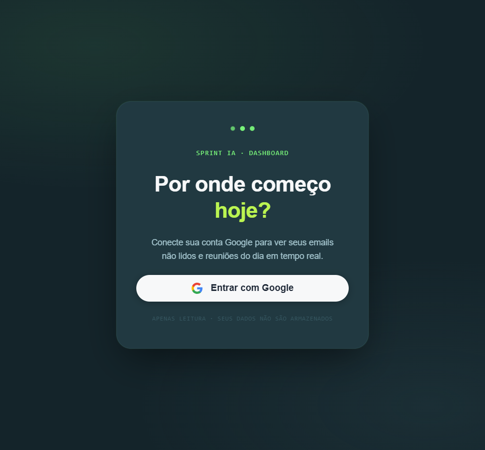
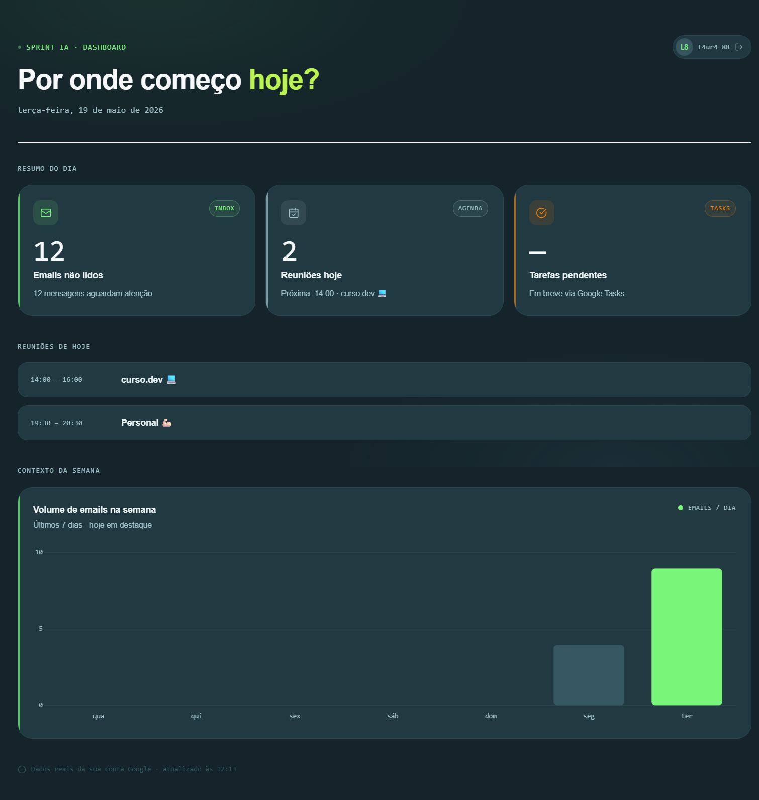

# 📆 Daily Dashboard

Dashboard to monitor daily e-mails, schedule and tasks.

> 🤖 Vibe coded with [Google Antigravity](https://antigravity.google/).

<div style="text-align: center;">
    
    
</div>

## 🧩 Tech Stack

- Next.js
- TypeScript
- Google OAuth
- Gmail API
- Calendar API

## 🛠️ Getting Started

### 1. Clone the repository and install dependencies
```bash

git clone https://github.com/l4ur4oliveira/sprint-ia.git
cd sprint-ia

npm install
```

### 2. Create a `.env.local` file and add your Google Client ID
```bash
cp .env.example .env.local
```

### 3. Run and open the application
```bash
npm run dev

# Open http://localhost:3000
```
